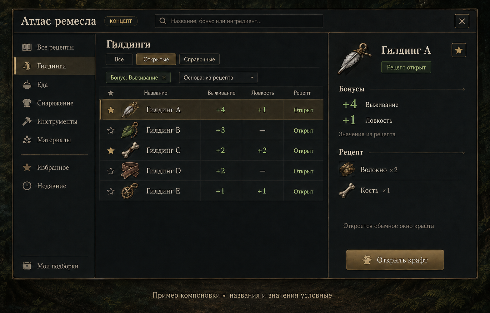

# Атлас ремесла — отдельное окно крафта и энциклопедия

Дата: 2026-09-03. Редакция 2: учтены правки пользователя и источники Ring of Brodgar. Реализация не начата.

## Результат для игрока

Самостоятельное окно «Атлас ремесла»: найти предмет по названию, эффекту или ингредиенту, посмотреть бонусы в таблице, пройти по цепочке изготовления компонентов, увидеть требуемые станки и инструменты, сохранить рецепт в избранное и открыть обычное окно крафта. Главные сценарии: «Какие гилдинги доступны моему персонажу?» и «Из чего и на чём делается этот предмет?»

Первый экран — таблица, а не дерево действий. Дерево категорий остаётся вспомогательной навигацией. Старое окно крафта сохраняется как отдельный способ работы.

Изображение — визуальный концепт, созданный встроенным imagegen. Названия, иконки предметов и значения условные; это не игровые данные и не работающий интерфейс. Единственное действие изготовления — «Открыть крафт», которое открывает обычное существующее окно с выбранным рецептом. Точные правила взаимодействия задаёт эта спецификация.

В текущем объёме отсутствуют кнопки «Сравнить», «Проверить материалы» и «Подробнее», панель сравнения, множественный выбор, проверка запасов и встроенное изготовление. Все сведения о выбранном предмете видны непосредственно справа. Сортировка бонусов в общей таблице сохраняется.

## Выбранный подход

| Вариант | Что даёт | Ограничение |
| --- | --- | --- |
| **Отдельный Атлас с таблицей и карточкой — рекомендован** | Обзор бонусов, единый поиск, независимое развитие справочника | Требуется общий слой данных и переход в обычное окно крафта |
| Расширить существующий `NCraftWindow` | Меньше изменений в управлении изготовлением | Каталог, вкладки рецептов и автокрафт перегрузят одно окно |
| Отдельная энциклопедия только для чтения | Простая интеграция справочных данных | Переход от выбора предмета к изготовлению останется разорванным |

У Ender полезны общий каталог, избранное, история и поиск по свойствам предметов. Это подтверждено в [CraftDBWnd](https://github.com/EnderWiggin/hafen-client/blob/master/src/haven/CraftDBWnd.java) и [ItemFilter](https://github.com/EnderWiggin/hafen-client/blob/master/src/haven/ItemFilter.java). Здесь основное развитие идеи — бонусы в таблице, видимые фильтры и справочные записи рядом с доступными рецептами.

## Компоновка и внешний вид

Три области: навигация слева, результаты по центру, подробности справа. Поиск закреплён сверху. Выбор строки обновляет карточку, сохраняя запрос, фильтры и положение списка.

- Разделы: **Все рецепты, Гилдинги, Еда, Снаряжение, Инструменты, Материалы**. Локальные категории меню доступны внутри «Все рецепты». Дополнительные разделы добавляются только при наличии структурированных данных.
- Отдельные представления: **Избранное, Недавние**. Пользовательские подборки — последующее расширение.
- Переключатель: **Все / Открытые / Справочные**. При первом открытии выбран режим «Открытые». Справочные записи появляются при подключении соответствующего источника.
- Строка активных фильтров с крестиком у каждого и действием «Сбросить». В сложном поиске игрок всегда видит, какие ограничения применены.
- Заголовки колонок закреплены. Сортировка числовая, направление видно. Ширина и состав колонок сохраняются отдельно для еды и гилдингов.
- Избранное отмечается звездой. Один выбранный предмет определяет содержимое правой карточки; дополнительные флажки выбора не нужны.

Визуальный язык: графитовый фон `#171B1E`, панели `#22282B`, основной текст `#EEE8D7`, латунный акцент `#BCA275`. Зелёный сопровождает подтверждённую доступность, янтарный — неполные сведения. Каждое состояние имеет текст и иконку: цвет не является единственным сигналом.

Декор сосредоточен в рамке и заголовке. Для поиска, таблицы и чисел — читаемый шрифт без засечек; художественный шрифт допустим в названии. Игровые иконки используются после загрузки ресурсов. Основные бонусы видны без наведения.

Ориентир размера: 1160×700 логических единиц, боковая навигация 176, карточка 320, остальное — таблица. Все размеры проходят через `UI.scale` один раз и ограничиваются фактической областью игры. При нехватке ширины карточка открывается вместо списка с кнопкой «Назад», навигация сворачивается в выбор раздела. Состояние списка сохраняется. При увеличенном масштабе окно не уходит за экран.

## Гилдинги: основной сценарий

Игрок открывает «Гилдинги», выбирает бонус «Выживание», видит все подходящие рецепты и сортирует по величине бонуса. Несколько бонусов можно требовать одновременно; переключатель «Все выбранные / Любой выбранный» задаёт логику явно.

| Колонка | Назначение |
| --- | --- |
| Избранное | Звезда без открытия рецепта |
| Предмет | Иконка, локализованное название, оригинальное название в подсказке |
| Выбранный бонус | Числовая величина, основная сортировка |
| Другие бонусы | До двух дополнительных характеристик; остальные раскрываются в карточке |
| Рецепт | Открыт / недоступен сейчас / сведения загружаются |

В карточке: все бонусы, атрибуты гилдинга, исходный диапазон вероятности дополнительного слота, ингредиенты с количеством и заменами, отдельный блок требований со станками, инструментами, навыками и открытиями, а также модификаторы качества — если эти сведения доступны. Длинное содержимое прокручивается непосредственно в карточке; отдельная кнопка раскрытия не нужна.

Ингредиент с известным способом изготовления отображается как ссылка: иконка, название, количество и стрелка перехода. Клик открывает карточку рецепта этого ингредиента внутри Атласа. Например, из рецепта топора можно перейти к клею и увидеть рецепт клея вместе с необходимым станком. Обычный некликабельный ряд означает, что предмет собирается, добывается, покупается либо его рецепт ещё неизвестен.

По [Gilding — Ring of Brodgar](https://ringofbrodgar.com/wiki/Gilding), вероятностная механика относится к получению дополнительного слота. Поэтому исходный диапазон не подписывается «шанс успешной установки» или «ваш шанс». Атрибуты гилдинга и предоставляемые бонусы отображаются как разные поля. Персонального калькулятора в текущем объёме нет.

Обозначения: `—` — подтверждённое отсутствие свойства; `?` — данных нет; `…` — загрузка. Неизвестное значение не заменяется нулём и всегда сортируется после известных.

## Поиск без обязательного языка команд

Обычный ввод ищет по названию, русским и английским синонимам, характеристикам и известным ингредиентам. Примеры: «гилдинги», «выживание», «survival», «кость». Поисковые совпадения сопровождаются краткой причиной: «даёт Выживание», «использует Кость».

Кнопка «Фильтры» открывает доступные условия:

- тип предмета и доступность рецепта;
- конкретный бонус, минимум значения и основа значений;
- ингредиент «содержит» или «исключить»;
- только избранное;
- для еды — FEP-характеристика, событие +1/+2, голод, энергия.

Регистр, повторные пробелы и `ё/е` не влияют на результат. Названия и алиасы локализуются, идентификаторы не зависят от языка. Несколько текстовых слов соединяются AND; каждое слово может совпасть с любым индексируемым полем. Точное совпадение названия выше совпадения по ингредиенту. Текст и видимые фильтры соединяются AND.

Синтаксис вроде `type:gilding bonus:survival>=3` можно добавить после первой версии как удобный ввод тех же фильтров. Естественный язык произвольной сложности и отдельная LLM для поиска не требуются.

Если результатов нет, показываются применённые ограничения и действие сброса. Не загруженные свойства не трактуются как «не подходит»: рядом со счётчиком указывается число ещё не обработанных записей.

## Еда

Представление использует тот же поиск и навигацию, но другой набор колонок: **блюдо, выбранный FEP, FEP/голод, голод, энергия, доступность**. Полное распределение FEP и состав находятся справа. События +1 и +2 видны раздельно.

Рецепт изготовления и зарегистрированный вариант еды — разные сущности. Варианты с различным составом группируются под рецептом и раскрываются. Их FEP нельзя усреднять или выбирать максимумы из разных вариантов, создавая несуществующее блюдо.

Источник и основа значений указаны явно: «из рецепта», «наблюдённый предмет, q=…», «справочник». Сравнение при q10 допускается только для показателей с проверенной нормализацией. FEP/голод вычисляется после приведения единиц источника; при неизвестном или нулевом знаменателе результат не подменяется обычным числом. Насыщения и прочие модификаторы персонажа не включаются в базовые цифры молча.

## Доступность рецепта

Отдельно учитываются:

1. **Действие доступно персонажу:** подтверждается текущим серверным меню. Наличие записи в кэше или wiki этого не доказывает.
2. **Известен состав рецепта:** данные могут быть полными, частичными или отсутствовать.

Ингредиенты отображаются как требования рецепта, без учёта запасов игрока. Атлас не проверяет инвентарь, зоны или хранилища и не показывает отметки «хватает / не хватает / запасы не проверены».

«Открыт» не означает «можно изготовить прямо сейчас»: могут отсутствовать станок, инструмент или материалы. При неизвестных условиях кнопка открытия рецепта остаётся доступной; итог изготовления определяет сервер через обычное окно крафта. Для справочного рецепта изготовление недоступно, но доступны чтение и избранное.

Отсутствие рецепта в меню не всегда доказывает отсутствие изученного навыка. Подпись по умолчанию — «Недоступен сейчас». «Не изучено: …» показывается только при подтверждённых требованиях и данных персонажа. Пока начальная синхронизация меню не закончена, состояние — «Проверяется».

## Карточка и выполнение крафта

Один клик или Enter в списке открывает только карточку. Перемещение по результатам не отправляет действий серверу и не переключает текущий крафт. `Ctrl+F` фокусирует поиск, стрелки меняют выделение, Escape сначала закрывает выпадающую панель, затем окно. Enter в поиске не запускает изготовление и не проходит к горячим клавишам старого крафта.

### Переходы по цепочке рецептов

Внутренняя навигация работает как история страниц: над карточкой отображается путь `Топор › Клей`, рядом — кнопки назад и вперёд. Переход к ингредиенту не меняет запрос и список результатов слева; возврат восстанавливает выбранный рецепт, прокрутку карточки и раскрытые группы.

Если ингредиент создаётся несколькими рецептами, вместо автоматического выбора показывается компактный список вариантов с результатом, входами и требованиями. Выбранный вариант становится следующей страницей истории. Если рецепт один, переход происходит сразу. Если рецепт указывает на текущий предмет или образует цикл, ссылка остаётся доступной, но повторная карточка помечается «Циклическая зависимость» и не раскрывается рекурсивно автоматически.

Ингредиенты-категории показываются как «любой предмет категории». Альтернативы раскрываются внутри одного входного слота; они не превращаются в несколько обязательных компонентов. У каждой альтернативы может быть собственная ссылка на способ получения.

Блок **«Требуется»** отделён от потребляемых ингредиентов:

- **Станок** — место изготовления, например верстак, печь или котёл; не расходуется. Если для станка есть собственная страница/рецепт строительства, его название также открывается в Атласе.
- **Инструмент** — переносимый или экипированный предмет; не расходуется. Категория инструмента показывает подходящие варианты.
- **Навык / открытие** — условие доступности рецепта; не является предметом.
- **Неизвестное требование** — отображается как `?`, а не скрывается.

Клик по станку или инструменту открывает его карточку тем же механизмом истории. Клик по навыку показывает доступное описание без попытки открыть крафт. Атлас не утверждает наличие станка или инструмента у игрока и не проверяет запасы.

Кнопка **«Открыть крафт»** повторно проверяет выбранную `Pagina` в текущем меню и активирует её штатным путём. Рецепт появляется в обычном существующем окне крафта. Атлас сохраняет поиск, прокрутку и выделение. Само изготовление при этом не запускается.

На правой панели это единственная нижняя кнопка действия. Над ней допустима подпись «Откроется обычное окно крафта». Встроенная панель изготовления, перенос `NMakewindow` и изменение владельца активного крафта сейчас не планируются.

Текущая цепочка `NGameUI.addchild → NCraftWindow → NMakewindow` продолжает обслуживать изготовление. Закрытие Атласа закрывает только каталог и не отправляет закрытие существующему окну крафта. Несколько кликов во время открытия одного рецепта не должны дублировать запрос. Боты продолжают использовать существующий `craftwnd.makeWidget`.

История первой версии называется «Недавние рецепты» и содержит явно открытые для крафта рецепты. Просмотр карточки туда не попадает. Успешное изготовление не заявляется по одному нажатию кнопки.

## Источники и модель данных

Проверенная основа в текущем проекте:

| Существующий код | Что можно использовать |
| --- | --- |
| `src/haven/MenuGrid.java`: `PagButton.info`, `uimsg("fill")` | Доступные действия и структурированные подсказки рецептов |
| `src/nurgling/NRecipeTooltip.java`: `build` | Уже различает Inputs, Skills, Seen, Slotted, NFoodInfo и другие типы сведений |
| `src/haven/res/ui/tt/slot/Slotted.java` | Диапазон шанса, связанные атрибуты, вложенные бонусы AttrMod |
| `src/nurgling/widgets/NMakewindow.java` | Активные входы/выходы, качество, инструменты, сохранение состава; изготовление остаётся в обычном окне |
| `src/nurgling/tools/RecipeIngredientCache.java` | Связи ингредиент → рецепт и результат → рецепт, сохранённые количества |
| `src/nurgling/widgets/NCookBook.java`, `src/nurgling/cookbook/Recipe.java` | Еда, варианты состава, FEP, голод, энергия, существующее избранное еды |
| `src/nurgling/NGameUI.java`, `src/nurgling/widgets/NCraftWindow.java` | Маршрутизация виджетов изготовления и нынешний жизненный цикл |

`EncyclopediaWindow` сейчас отображает справочные Markdown-документы. Новый Атлас получает собственное окно и модель; объединение с этой справкой не требуется.

Предлагаемые небольшие компоненты:

- **CraftCatalog** — агрегирует записи и публикует неизменяемые снимки с номером ревизии.
- **RecipeInfoExtractor** — получает поля из ItemInfo и данных изготовления; рисование tooltip не является источником данных. Существующее распознавание в NRecipeTooltip следует точечно переиспользовать, избегая второго расходящегося парсера.
- **CraftSearchIndex** — поиск, фильтрация, числовая сортировка; независим от виджетов и сервера.
- **CraftRecipeGraph** — индексирует выходы рецептов и разрешает `ингредиент → один или несколько способов изготовления`, сохраняя альтернативы и защищая навигацию от циклов.
- **CraftAtlasHistory** — хранит переходы назад/вперёд и состояние выбранной карточки независимо от списка результатов.
- **CraftAtlasWindow** — навигация, таблица и карточка.
- **CraftExecutionBridge** — повторная проверка доступности и явное открытие выбранного рецепта в обычном окне крафта.
- **CraftAtlasPreferences** — локальное избранное, недавние, колонки и положение окна для профиля персонажа.
- **WikiCatalogProvider** — последующее подключение проверенного справочного набора Ring of Brodgar.

Ключ записи изготовления: ресурс действия и устойчивый признак варианта, когда он присутствует. Временный серверный id нельзя хранить как постоянный идентификатор. Для wiki без сопоставленного действия — собственный ключ источника. Привязка по одному локализованному названию недостаточна. Ключ варианта еды сохраняет существующий hash.

Рецепт содержит входные слоты с количеством, единицей, обязательностью и альтернативами, список выходов, требования и свойства результата. Требования типизированы как `STATION`, `TOOL`, `SKILL` или `DISCOVERY` и не смешиваются с расходуемыми входами. Категория ингредиента не разворачивается в набор обязательных предметов. Сохранённые имя/количество из старого кэша не считаются полной спецификацией альтернатив и ограничений.

Граф строится по устойчивым идентификаторам ресурсов. Связь только по локализованному имени допускается как явно помеченная справочная гипотеза и не используется для команды «Открыть крафт». Один выход может иметь несколько рецептов, а один вход — несколько альтернатив; модель не должна терять эту множественность.

У каждого значения: источник, время/версия, основа качества и статус известности. Текущие серверные поля имеют приоритет перед совместимыми кэшированными; справочник заполняет пробелы. Данные с разной основой не склеиваются в один показатель. Cookbook присоединяет варианты еды, а не перезаписывает рецепт изготовления. Конфликтующие справочные сведения остаются видны в подробностях.

Доступность берётся только из текущей сессии. Кэшированные описания можно разделять, но доступность, избранное и история относятся к персонажу и серверу. При переключении сессии подписки и результаты старых задач отбрасываются.

Наблюдения собираются из полученных подсказок и реально открытых рецептов. Фоновое перебирание меню с отправкой команд для массового сбора запрещено в рамках этого дизайна: каталог должен работать без изменения игрового состояния.

## Wiki и ещё не открытые рецепты — следующий этап

Источник выбран пользователем — **Ring of Brodgar**. Проверены страницы:

- [Gilding](https://ringofbrodgar.com/wiki/Gilding): список предметов, бонусы, атрибуты и диапазоны. Рецепты и требования нужно брать из отдельных страниц предметов, на которые ссылается таблица.
- [Category:Foods](https://ringofbrodgar.com/wiki/Category:Foods): каталог еды с подкатегориями и постраничной выдачей. При импорте обходятся все страницы категории и нужные подкатегории с удалением дублей; одна страница не считается полным каталогом. Значения еды и рецепты берутся из страниц предметов и связанной таблицы.
- [FEP Table](https://ringofbrodgar.com/wiki/FEP_Table): базовые значения еды при q10; для переменного состава это базовый или распространённый вариант, а не все возможные комбинации ингредиентов. Так и подписывать импортированные значения.

Подключать версионированный набор структурированных данных с URL источника и датой проверки, подготовленный вне игрового интерфейса. Не загружать и не разбирать страницы при каждом открытии окна. Схема импорта уточняется при реализации этого этапа; основной каталог не зависит от доступности сайта.

Еда и гилдинги из wiki могут добываться без действия изготовления. Такие записи получают способ получения и подпись «Рецепта крафта нет», а не «Не изучено»; кнопка открытия крафта отключена. Если действие просто ещё не сопоставлено, используется отдельная подпись «Рецепт не сопоставлен». Это не основание угадывать команду по названию.

Справочная строка слегка приглушена, имеет значок замка и текстовый статус, но остаётся полностью читаемой и выбираемой. Игрок видит рецепт, бонусы и известные требования, может добавить её в избранное. Недоступно только выполнение. Если сервер затем добавляет действие, строка меняет доступность без дублирования и потери избранного.

Без сети используется последний корректный набор. Неполная или устаревшая запись имеет явную пометку. При обновлении проверяются схема и ссылки идентификаторов; ошибочный набор не заменяет рабочий. Полнота всей игровой энциклопедии не обещается до проверки покрытия данных.

## Отзывчивость и ошибки

Каталог из меню работает без внешней БД. При недоступности БД скрываются только отсутствующие дополнительные сведения; поиск по уже полученным данным и локальное избранное продолжают работать. Cookbook использует существующую инфраструктуру при её наличии.

`Loading` — нормальное состояние, не пустой результат. Названия появляются раньше иконок и дополнительных свойств. В `draw` нет SQL, сетевых операций, `loadwait`, массового разбора tooltip или создания текстур всей таблицы. Рисуются видимые строки, кэш текстур ограничен и освобождается при уничтожении.

UI-зависимые объекты читаются в допустимом потоке клиента, обработка поиска идёт по снимкам. Результат поиска применяется только при совпадении ревизии каталога, сессии и актуального запроса. Закрытие окна снимает подписки.

Целевой бюджет, который предстоит измерить: поиск по 10 000 подготовленных записей — p95 до 100 мс без учёта загрузки ресурсов; окно остаётся интерактивным при поступлении данных. Это критерий будущей проверки, не результат измерения текущей реализации.

## Последовательность реализации

1. **Каталог, гилдинги и цепочки рецептов.** Отдельное окно, данные текущего персонажа, поиск, таблица бонусов, карточка, избранное, недавние, кликабельные ингредиенты, станки/инструменты отдельным блоком, история переходов и кнопка открытия обычного крафта. Еда из ItemInfo доступна в общем каталоге.
2. **Еда.** Подключение вариантов Cookbook, фильтров по составу и FEP, корректное отображение источника и основы значений.
3. **Справочный каталог Ring of Brodgar.** Версионированные wiki-данные, недоступные рецепты, способы получения, известные требования и переход в доступное состояние.

Именованные подборки и сохранённые фильтры могут добавляться после проверки удобства. Пункт «Мои подборки» на визуальном концепте обозначает это возможное расширение и не обязателен для первой версии. Сравнение отдельным действием, проверка запасов, встроенный крафт и автокрафтовая очередь в текущий план не входят.

## Проверка будущей реализации

- Из структурированных данных корректно извлекаются Slotted/AttrMod, входы с альтернативами, FEP +1/+2; частичные данные не становятся нулём.
- Фильтр по Выживанию находит соответствующие гилдинги независимо от имени; сортировка числовая, отсутствующие значения в конце.
- Выбор и просмотр сотни строк не отправляют игровых команд. Кнопка открытия повторно проверяет текущую доступность, справочная запись не выполняется.
- Избранное переживает перезапуск, смену языка и обновление каталога; разные персонажи не получают чужую доступность.
- Без БД, при `Loading`, при повреждённом локальном файле настроек и при смене сессии окно остаётся пригодным для работы.
- «Открыть крафт» вызывает обычное окно с выбранным рецептом без запуска изготовления; проверяются быстрые повторные клики и поздние ответы. Закрытие Атласа не закрывает обычный крафт и не мешает существующим ботам.
- Ингредиент с одним рецептом открывает его карточку; с несколькими — выбор вариантов; без рецепта остаётся обычным рядом. Назад/вперёд восстанавливают страницу и прокрутку без изменения поискового результата.
- Циклические связи не вызывают рекурсию или зависание. Категории и альтернативы сохраняют смысл входного слота.
- Станки, инструменты, навыки и открытия отображаются отдельно от расходуемых ингредиентов. Кликабельные станки и инструменты используют тот же граф, но Атлас не показывает их как расходуемые.
- В интерфейсе отсутствуют кнопки «Сравнить», «Проверить материалы», «Подробнее», панель сравнения и индикаторы запасов. Полная карточка доступна непосредственно справа.
- Wiki-записи без рецепта изготовления и записи без сопоставленного действия имеют разные подписи и не отправляют команды серверу.
- Визуальная проверка на 1280×720 и 1920×1080 при масштабе 100%, 125%, 150%: поиск и действия доступны, последняя строка достижима, фокус и Escape предсказуемы.

Для данного проектирования проверены перечисленные точки интеграции по исходникам, страницы Gilding и Category:Foods, создан и скорректирован визуальный концепт. Исполняемый код не изменён; сборка и игровые тесты к этому документу не применялись.

Запрос текущей редакции встроенному imagegen: [imagegen edit prompt](2026-09-03-craft-atlas-image-prompt-v2.txt). Первоначальный макет сохранён отдельным файлом как предыдущая редакция.
